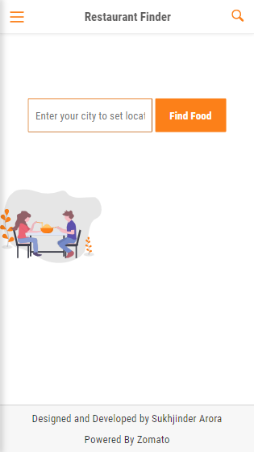
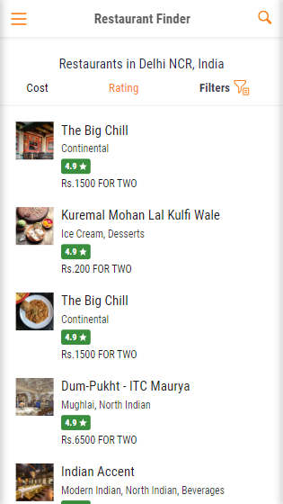
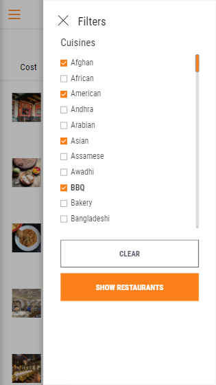
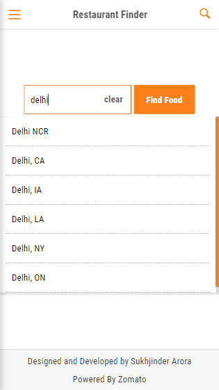
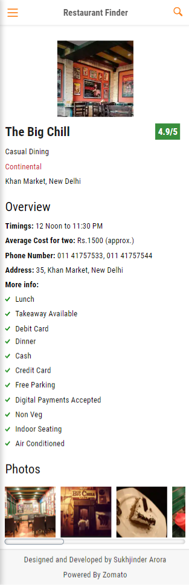
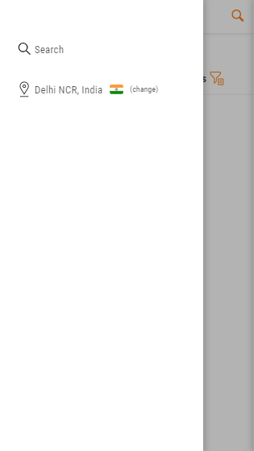

<h1 align="center">
  
  <br>
Restaurant Finder - Find great restaurants near you
</h1>

<font size="3">
Restaurant finder is an app in which you can:

- Search for more than 1.5 million restaurants across 10,000 cities globally.
- Get a list of restaurants in your city.
- Filter restaurants based on cuisines.
- Sort restaurants by ratings and cost.
- Search for a restaurant in your city.
- Search for restaurants in another location.
- Get restaurant's reviews, photos and information such as cuisines, timings and services offered by restaurant.

**_Take a look at the live version here:_** https://restaurantfinder1.netlify.app/

# Technologies Used

This project is built using:

- ReactJS
- React Router V6
- Styled-Components
- Redux
- Redux-Thunk

# Development Workflow

### Steps to run this application locally:

1. Start by cloning the repository into your local file system.

   ```bash
   git clone https://github.com/SukhjinderArora/restaurant-finder.git
   ```

2. CD in to the project directory

   ```bash
   cd restaurant-finder
   ```

3. Open the repository in your favorite code editor.
4. Rename the `.env.example` to `.env` and set up all the environment variables mentioned in that file.
5. Finally run this command to start the application:

   ```bash
   npm start
   ```

   This command starts a local development server, opens application in your default browser, and watches for changes via livereload.

6. Optionally, you can use `npm run build` to build the production version of the application.

# Screenshots

## Restaurants Page


## Location Page


## Search Page


## Restaurant Filters


# Restaurant Page


# Image Modal


# Responsive Design

This is web app is fully responsive to devices of all screen sizes. For example:

<p align="top" overflow="hidden">
  
  
   
</p>
<p align="top">
  
  
   
</p>

# Deploying To Netlify

Follow this guide to deploy the application to Netlify: https://docs.netlify.com/get-started/#deploy-a-project-to-netlify

# Credits:

## This app uses :

- Zomato API to get the restaurants data.

# License

MIT License
